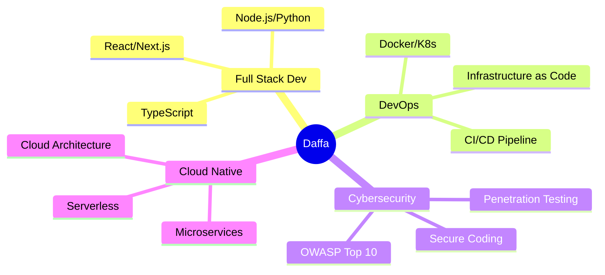

<div align="center">
  
</div>

<div align="center">
  
</div>

<p align="center">
  
  
  
</p>

<br/>

<!-- Snake Animation -->
<div align="center">
  
</div>

<br/>


### 🚀 About Me

```typescript
const daffa = {
    code: ["JavaScript", "TypeScript", "Python", "Go", "Java"],
    askMeAbout: ["web dev", "cloud", "devops", "cybersecurity"],
    technologies: {
        frontEnd: {
            js: ["React", "Next.js", "Vue.js"],
            css: ["Tailwind", "Bootstrap", "Material-UI"]
        },
        backEnd: {
            js: ["Node.js", "Express", "NestJS"],
            python: ["Django", "FastAPI", "Flask"],
            others: ["Go", "Java Spring Boot"]
        },
        devOps: ["Docker🐳", "Kubernetes☸️", "CI/CD", "Terraform"],
        cloudServices: {
            aws: ["EC2", "S3", "Lambda", "RDS"],
            gcp: ["Cloud Run", "GKE", "Cloud Functions"]
        },
        databases: ["PostgreSQL", "MongoDB", "Redis", "MySQL"],
        security: ["OWASP", "Penetration Testing", "Secure Coding"]
    },
    currentFocus: "Building secure and scalable cloud-native applications",
    funFact: "There are two ways to write error-free programs; only the third one works"
};
```

<br clear="right"/>

---

## 🛠️ Tech Arsenal

<details open>
<summary><b>🎨 Frontend Development</b></summary>
<br>


</details>

<details open>
<summary><b>⚙️ Backend Development</b></summary>
<br>


</details>

<details open>
<summary><b>🗄️ Database & Caching</b></summary>
<br>


</details>

<details open>
<summary><b>☁️ DevOps & Cloud</b></summary>
<br>


</details>

<details open>
<summary><b>🛡️ Cybersecurity</b></summary>
<br>


</details>

---

## 📊 GitHub Analytics

<p align="center">
  
  
</p>

<p align="center">
  
  
</p>

<div align="center">
  
</div>

---

## 🏆 GitHub Trophies

<div align="center">
  
</div>

---

## 🔥 Recent Activity

<!--START_SECTION:activity-->
<!--END_SECTION:activity-->

---

## 📈 Contribution Graph

<div align="center">
  
</div>

---

## 🎯 Current Focus

<div align="center">



</div>

---

## 💼 Professional Skills

<div align="center">

| Category | Skills |
|----------|--------|
| **Languages** | JavaScript, TypeScript, Python, Go, Java, Bash |
| **Frontend** | React, Next.js, Vue.js, Tailwind CSS, Redux |
| **Backend** | Node.js, Express, Django, FastAPI, Spring Boot |
| **Database** | PostgreSQL, MongoDB, Redis, MySQL, Elasticsearch |
| **DevOps** | Docker, Kubernetes, Jenkins, GitHub Actions, ArgoCD |
| **Cloud** | AWS (EC2, S3, Lambda, RDS), GCP, Azure |
| **Security** | OWASP, Penetration Testing, Secure SDLC |
| **Tools** | Git, Linux, Nginx, Terraform, Ansible, Grafana |

</div>

---

## 🌐 Connect with Me

<div align="center">
  
[](https://linkedin.com/in/daffarobbani)
[](https://twitter.com/daffarobbani)
[](https://instagram.com/daffarobbani)
[](https://daffarobbani.dev)
[](mailto:your.email@example.com)
[](https://discord.gg/yourdiscord)

</div>

---

<div align="center">
  
</div>

---

<div align="center">
  
### 💭 Random Dev Meme
  


</div>

---

<div align="center">
  
**"First, solve the problem. Then, write the code."** – John Johnson


</div>
